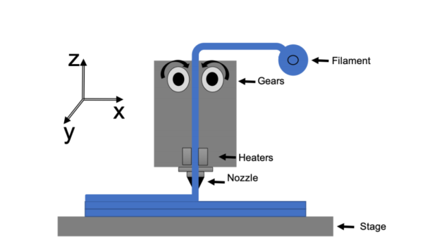
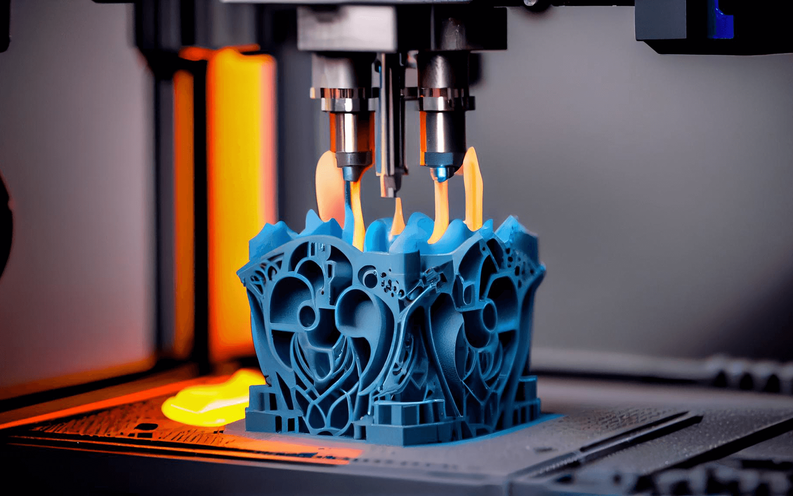
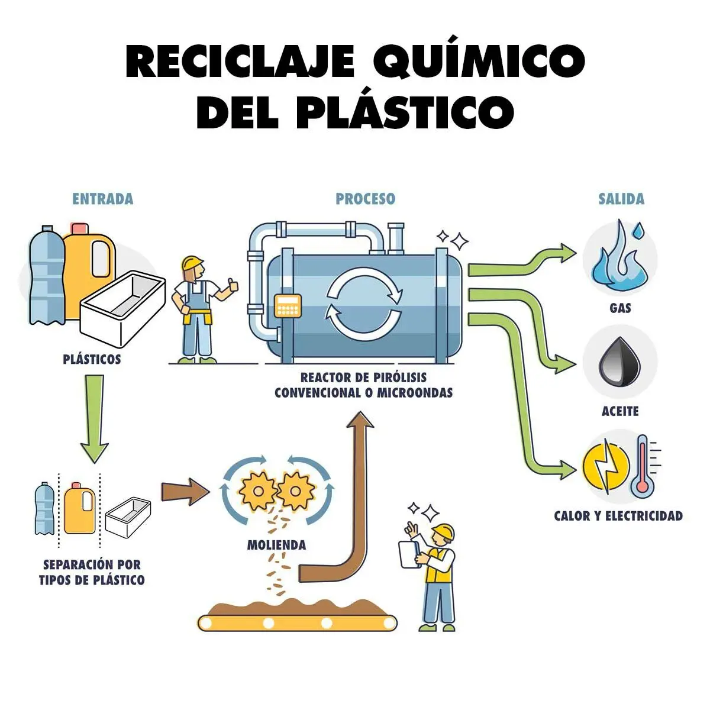
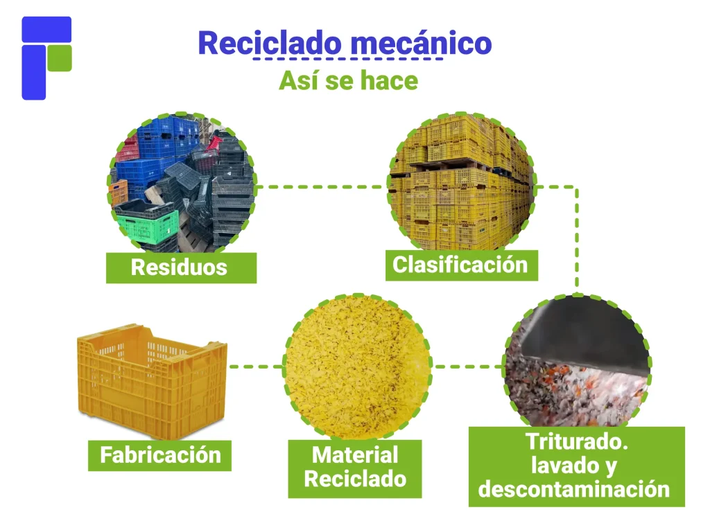

# 🧃 Plásticos PLA

Plásticos PLA

[🏁 Introducción](#introduccion){ .md-button .md-button--primary }
[📊 Propiedades](#propiedades){ .md-button .md-button--primary }
[⚠️ Limitaciones](#limitaciones){ .md-button .md-button--primary }
[🔥 Inyección PLA](#inyeccion-pla){ .md-button .md-button--primary }
[♻️ Reciclaje](#reciclaje){ .md-button .md-button--primary }
[🔗 Fuentes](#fuentes){ .md-button .md-button--primary }

---

## 🏁 Introducción {#introduccion}
El PLA es un termoplástico popular en impresión 3D; proviene de recursos renovables como almidón de maíz, tapioca o caña de azúcar y, almacenado a 15–25 °C, puede conservarse por ≥ 12 meses. Es inodoro, de baja inflamabilidad y con acabado similar al PET, ideal para prototipos y piezas estéticas con buena definición.

---

## 📊 Propiedades y características {#propiedades}
| **Propiedad**            | **Valor típico** | **Notas** |
|---------------------------|------------------|-----------|
| Temperatura de impresión | 190–220 °C       | Enfriamiento adecuado mejora bordes |
| Reblandecimiento (HDT)   | ≈ 50–60 °C       | Evitar calor sostenido |
| Densidad                 | ≈ 1.24 g/cm³     | Ligero para prototipos |
| Olor                     | Inodoro / suave  | Uso doméstico/educativo |
| Inflamabilidad           | Baja             | Comportamiento favorable |

---

## ⚠️ Limitaciones {#limitaciones}
- **Resistencia térmica baja** → se deforma desde 50–60 °C; no apto para calor sostenido.  
- **Ventana de proceso estrecha** y sensible a humedad (higroscópico).  
- **Más frágil que ABS/PETG** → evitar aristas vivas y altas cargas.

---

## 🔥 Moldeo por inyección de PLA {#inyeccion-pla}
### **Parámetros orientativos**
- **Zona barril:** ~160–190 °C *(evitar sobrecalentamiento → amarilleo/fragilidad)*  
- **Molde:** ~20–30 °C para estabilidad dimensional  
- **Secado previo** para minimizar hidrólisis y defectos

### **Recomendaciones de diseño**
- Evitar radios muy agudos; usar **filetes** o **chaflanes**  
- Controlar **tiempo de residencia** para limitar degradación  
- Puertas/canales que reduzcan **cizalla excesiva**

|  |  |
|:------------------------------------------------------:|:--------------------------------------------------:|
| **Diagrama proceso de inyección PLA**                  | **Pieza inyectada en PLA**                          |

---

## ♻️ Métodos de reciclaje de PLA {#reciclaje}
### **Reciclaje mecánico**
- **Proceso:** Triturado → lavado → secado → fusión → re-extrusión *(filamento/productos)*  
- Mejor para **corrientes limpias y homogéneas**; menor costo energético  
- Propiedades degradan tras múltiples ciclos → considerar **aditivos/mezclas**

### **Reciclaje químico**
- **Proceso:** Despolimerización *(hidrólisis/pirólisis/solvolisis)* → monómeros *(ác. láctico/lactida)*  
- **Purificación** → re-polimerización para PLA de alta calidad  
- Admite **residuos contaminados o mezclados**; proceso más complejo y costoso

---

### 🧩 Usos comunes
- 🎨 Piezas decorativas  
- 🧩 Prototipos visuales  
- 🍽️ Envases/contacto alimentario *(según normativa)*  
- 🧱 Modelos educativos  

[⬆️ Volver al inicio](#introduccion){ .md-button }

---

## 🔗 Fuentes {#fuentes}
- [NatureWorks – PLA Data Sheet](https://www.natureworksllc.com/)
- [3D Printing PLA Guide](https://all3dp.com/)
- [Wikipedia – PLA](https://es.wikipedia.org/wiki/Ácido_poliláctico)
